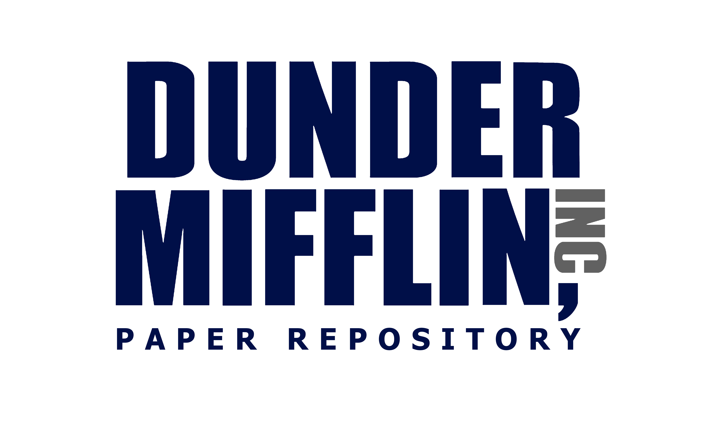

# Dunder Mifflin

Dunder Mifflin is a paper repository, containing all good papers we love.

## Requirements

- You need to download `chromedriver` (named as-is) and place it under `res`
  directory, e.g., `<project_root>/res/chromedriver`

## TODO

- [] Automatic paper download and file management
- [] `.bibtex` export

## Acknowledgement

- [GROBID](https://github.com/kermitt2/grobid) is a machine learning library for
  extracting, parsing and re-structuring raw documents such as PDF into
  structured XML/TEI encoded documents with a particular focus on technical and
  scientific publications.
- [Science Parse](https://github.com/allenai/science-parse) parses scientific
  papers (in PDF form) and returns them in structured form.
